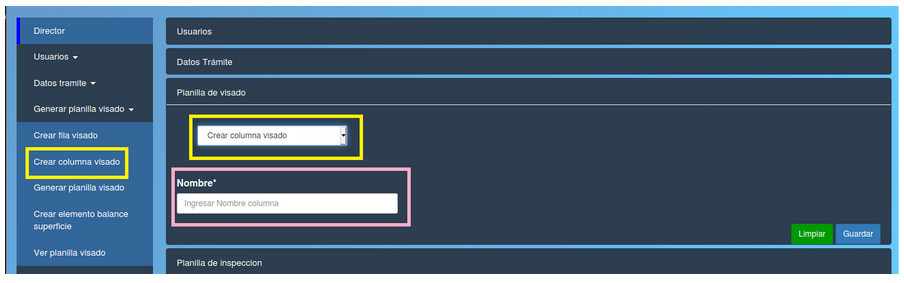

Crear columna visado
===========================

Esta opcion le permite al director crear una columna de visado.
Se debe llenar el formulario:

- **Nombre:** nombre de la columna de visado.

**Puede borrar los datos con el boton verde "Limpiar" o confirmar la operacion con el boton azul "Guardar"**

