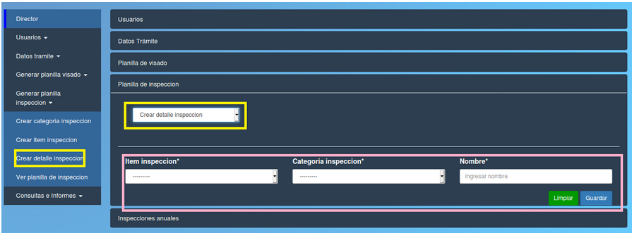

Crear detalle de inspeccion
======================================

 

Esta opción le permite al director crear un nuevo detalle de inspeccion.
Los campos del formulario que debe completar el director son:

- **Item inspeccion:** item de inspeccion (se depliegan los item que pertenecen al sistema).
- **Categoria inspeccion:** categoria de inspeccion (se depliegan las categorias que pertenecen al sistema).
- **Nombre:** nombre del detalle de inspeccion.

**Puede borrar los datos con el boton verde "Limpiar" o confirmar la operacion con el boton azul "Guardar"**

