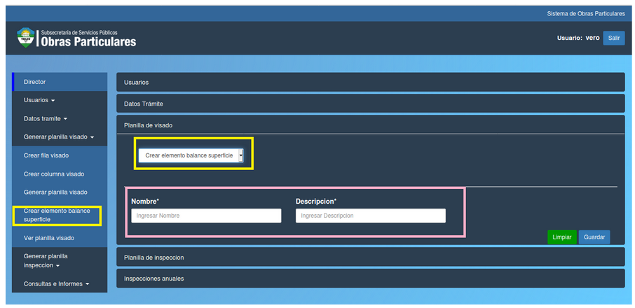

Crear elemento balance de superficie
======================================

 

Esta opción le permite al director crear un nuevo elemento de balance de superficie.
Los campos del formulario que debe completar el director son:

- **Nombre:** el nombre del elemento de balance.
- **Descripcion** una breve descripcion.

**Puede borrar los datos con el boton verde "Limpiar" o confirmar la operacion con el boton azul "Guardar"**

