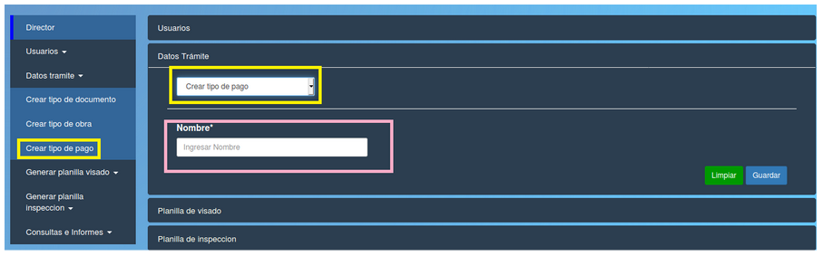

Crear tipo de pago
======================================

 

Esta opción le permite al director crear un nuevo tipo de pago.
Los campos del formulario que debe completar el director son:

- **Nombre:** el nombre del tipo de pago. 

**Puede borrar los datos con el boton verde "Limpiar" o confirmar la operacion con el boton azul "Guardar"**

