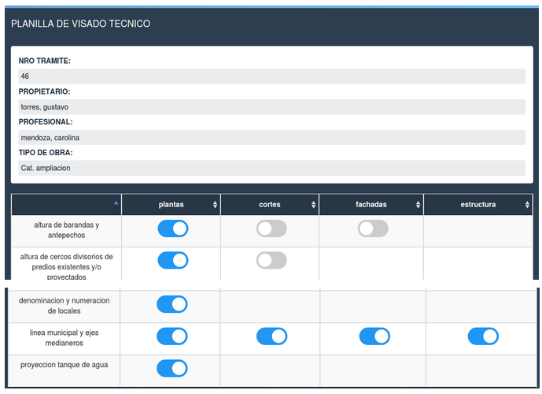
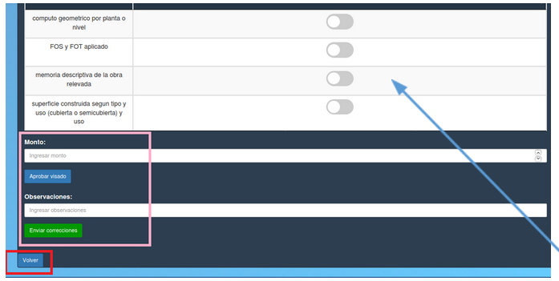

Generar visado
==================================================

El visador debe realizar el visado haciendo click sobre las opciones, debe ingresar el monto, aprobará el visado haciendo click sobre el boton “Aprobar visado” o enviará correcciones haciendo click sobre el botón verde “Enviar correcciones” ingresando una observacion. Para regresar a la pantalla anterior debe hacer click sobre el boton "Volver" enmarcado en rojo.

