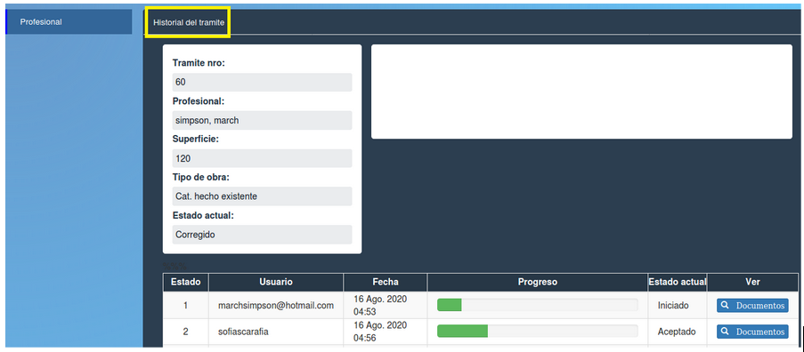

Historial del tramite
====================================

Esta opción permite ver el estado de cada tramite. Permite visualizar datos del tramite y una tabla con los siguientes datos:

- **Estado**
- **Usuario (que interactuo con el tramite ej visador en determinado fecha)**
- **Fecha**
- **Progreso**
- **Estado actual**
- **Ver (Documentos)** 

.. toctree::
   :maxdepth: 3
   
   documentosEstadoTramite

Para regresar a la pantalla anterior hacer click sobre el boton "Volver" enmarcado en rojo.

