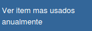
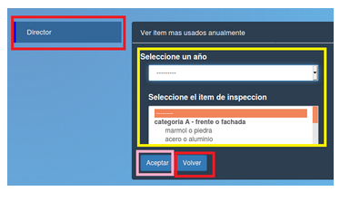

Ver items mas usados anualmente
===============================================

Permite ver la cantidad mensual de items seleccionado un item de inspección (frente o fachada, paredes, techos, cielorrasos) y un año determinado. Debe apretar el boton "Aceptar" enmarcado en rosa para ver el grafico y el boton "Volver" enmarcado en rojo.

.. toctree::
   :maxdepth: 3

   itemSeleccionItemAño
