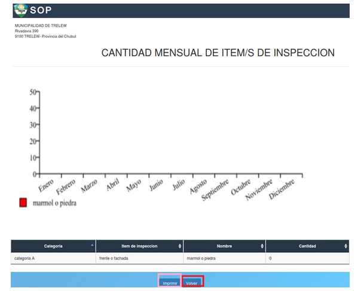

Cantidad mensual de item/s de inspeccion
===============================================

Permite ver la cantidad mensual de items seleccionado un item de inspección (frente o fachada, paredes, techos, cielorrasos) y un año determinado.  En caso de que el usuario quiera volver al menú principal, deberá presionar el botón “Volver” que está enmarcado en rojo. También el director puede exportar a formato PDF el reporte pulsando el botón azul “Imprimir” que está enmarcado en rosa.
