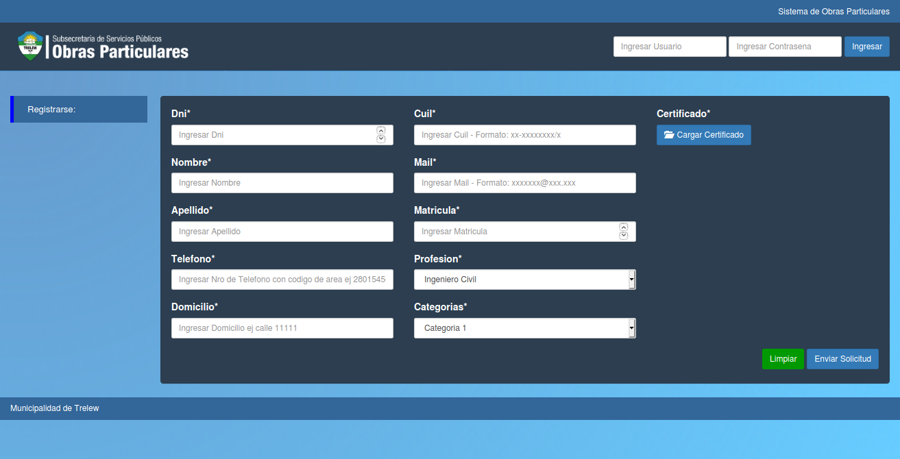

Obras 
====================================

Bienvenido a la de ayuda de usuario del sistema Obras. En esta pantalla encontrara dos funcionaliades principales:

Ingreso al sistema
------------------------------------

Para ingresar al sistema debera proporcionar los siguientes datos en los campos:

- **Nombre de usuario**: El nombre de usuario o el e-mail.
- **Contraseña**: La contraseña que haya recibido por e-mail.

una vez ingresados los datos debera hacer click en la opcion Ingresar

Creacion de un nuevo profesional
------------------------------------

Para solicitar el alta de un nuevo profesional en el registro de profesionales del sistema debera completar el formulario de alta de profesionales indicando los siguientes campos:

- **Dni**: Es el documento del profesional.
- **Nombre**: Es el nombre del profesional.
- **Apellido**: Es el apellido del profesional.
- **Telefono**: Es el telefono del profesional.
- **Domicilio**: Es el domicilio del profesional.
- **Cuil**: Es el cuil del profesional.
- **Mail**: Es el mail del profesional.

- **Matricula**: Es el numero de matricula habilitante del profesional.

- **Profesion**: Indica la profesion actual del profesional ingresado.
- **Categoria**: Indica la categoria que posee el profesional siendo posibles las siguientes opciones:
   * Categoria 1:
   * Categoria 2:
   * Categoria 3:
- **Certificado**: Campo disponible para la carga de una copia del certificado habilitante como ....

Una vez completado el formulario en su totalidad podra solicitar el alta de un nuevo profesional ingresando la opcion Enviar Solicitud, en caso de querer reestablecer los datos del formulario puede hacer click sobre el botón Limpiar

Observaciones:

- **No se podrá dar de alta a un profesional que ya existe**.

