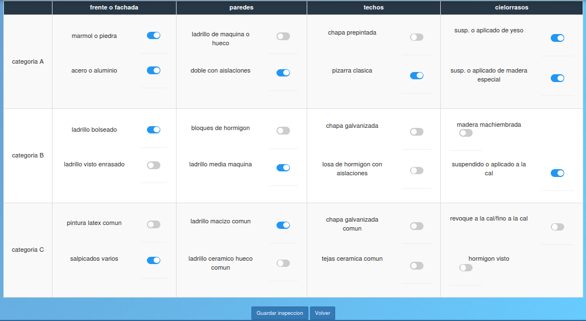

Inspeccionar
======================================

En esta vista el jefe inspector debe realizar la inspeccion seleccionando los detalles de inspeccion correspondientes a las categorias e items pertenecientes al tramite. Luego debera hacer click sobre el boton "Guardar inspeccion" enmarcado en rosa y volver haciendo click sobre el boton "Volver" enmarcado en rojo.
