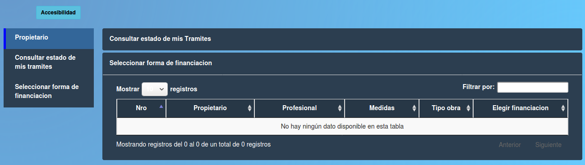

Seleccionar forma de financiacion
==============================================

Esta opcion permite al propietario visualizar datos de sus tramites y elegir una forma de financiar el tramite. Los datos presentes en la tabla son:

- **Nro (Número de trámite)**
- **Propietario**
- **Profesional**
- **Medidas**
- **Tipo obra**
- **Elegir financiacion**
