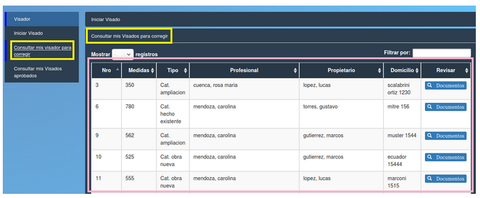

Consultar mis visados para corregir
====================================

**Al pulsar el botón se desplegará una tabla con la lista de visados con correcciones. 
Los campos que se observan en la tabla son:**

- **Nro (Número de trámite)**
- **Medidas**
- **Tipo**
- **Profesional**
- **Propietario**
- **Domicilio** 
- **Revisar (Documentos)**

.. toctree::
   :maxdepth: 3
   
   planillaVisadoParaCorregir

