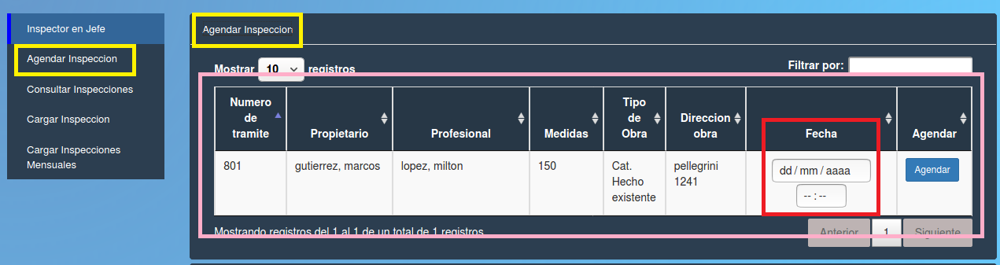

Agendar inspeccion
======================================

El jefe de inspeccion puede seleccionar de la tabla un tramite y agendar una inspeccion final ingresando en Fecha la fecha de inspeccion y la hora (en el cuadro que esta resaltado en rojo), los datos que contiene la tabla son:

- **Nro de tramite**
- **Propietario**
- **Profesional**
- **Medidas**
- **Tipo de obra**
- **Direccion obra**
- **Fecha**
- **Agendar**

