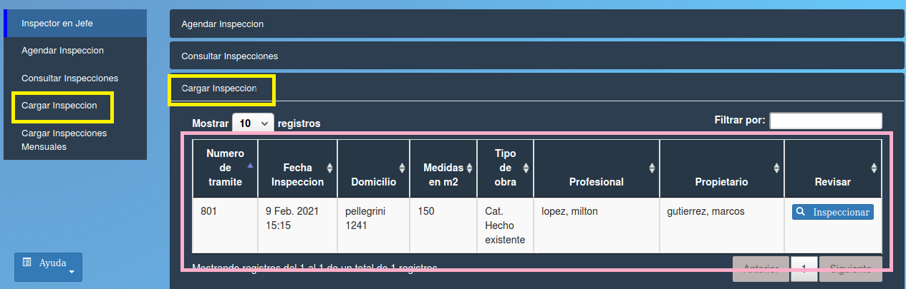

Cargar inspeccion
======================================

Este menú muestra todos los tramites que pueden ser inspeccionados. Los datos que contiene la tabla son:

- **Nro de tramite**
- **Fecha Inicio**
- **Tipo de obra**
- **Profesional**
- **Propietario**
- **Medidas en m2**
- **Estado**
- **Revisar (Documentos)**

.. toctree::
   :maxdepth: 3

   planillaInspeccion
