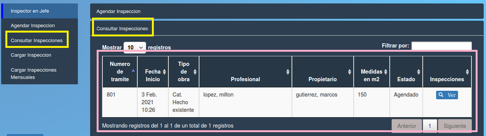

Consultar inspecciones
======================================

Este menú muestra todas las inspecciones realizadas. Los datos que contiene la tabla son:

- **Nro de tramite**
- **Fecha Inicio**
- **Tipo de obra**
- **Profesional**
- **Propietario**
- **Medidas en m2**
- **Estado**
- **Inspecciones (Ver)**

.. toctree::
   :maxdepth: 3

   listadoDeInspecciones
