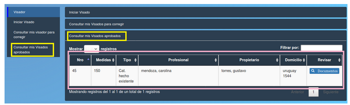

Consultar mis visados aprobados
===============================================
Permite ver los visados aprobados seleccionando un año de interés “Seleccionar un año”, después debe hacer click sobre el botón “Aceptar” enmarcado en rosa. En caso de que el usuario quiera volver al menú principal, deberá presionar el botón “Volver” enmarcado en rojo o el botón “Director” que se encuentra en el panel lateral izquierdo.

.. toctree::
   :maxdepth: 3

   ConsultarvisadosAprobados
