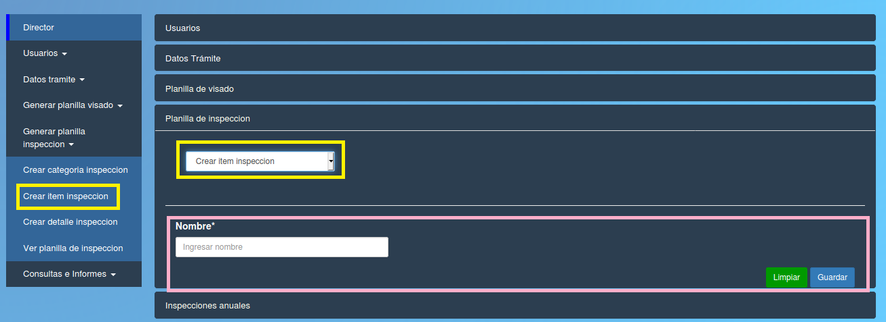

Crear item de inspeccion
======================================

 

Esta opción le permite al director crear un nuevo item de inspeccion.
Los campos del formulario que debe completar el director son:

- **Nombre:** el nombre del item.

**Puede borrar los datos con el boton verde "Limpiar" o confirmar la operacion con el boton azul "Guardar"**

