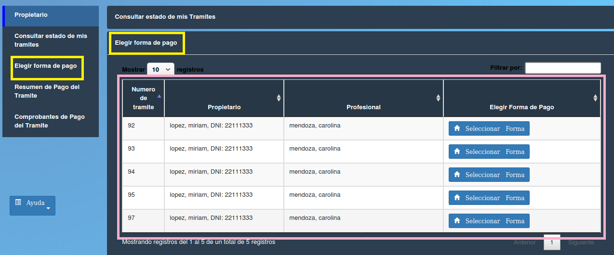

Elegir forma de pago
==============================================

Esta opción permite visualizar datos de los trámites y haciendo click sobre el botón “Seleccionar Forma” dar una forma de financiación al trámite. Los datos contenidos en la tabla son:

- **Numero de tramite**
- **Propietario**
- **Profesional**
- **Elegir forma de pago (Seleccionar Forma)**

.. toctree::
   :maxdepth: 2

   elegirModoPago2
