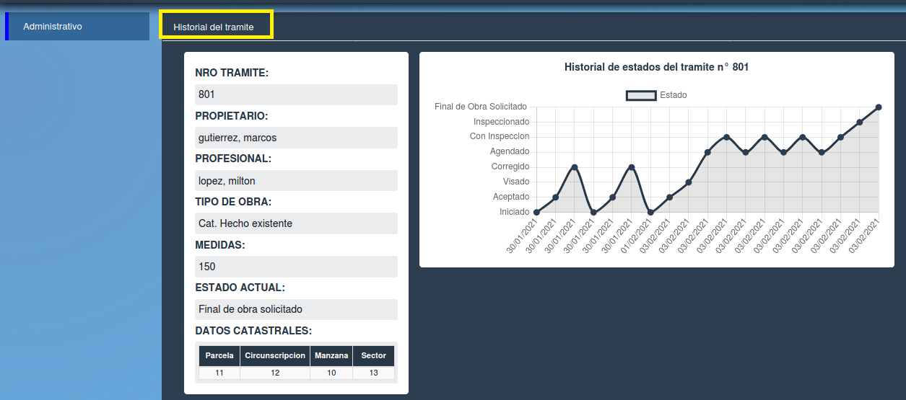
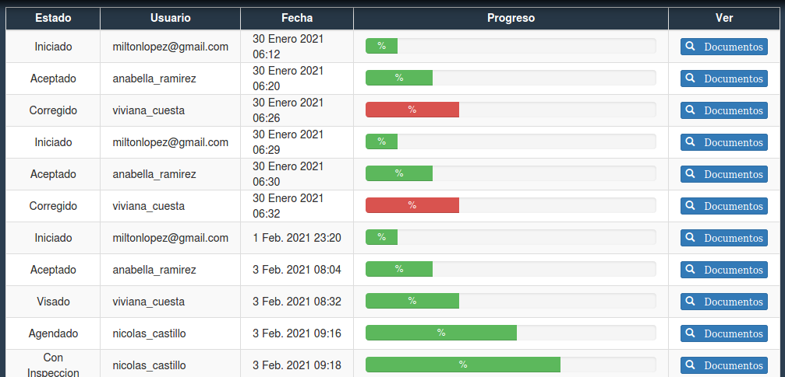
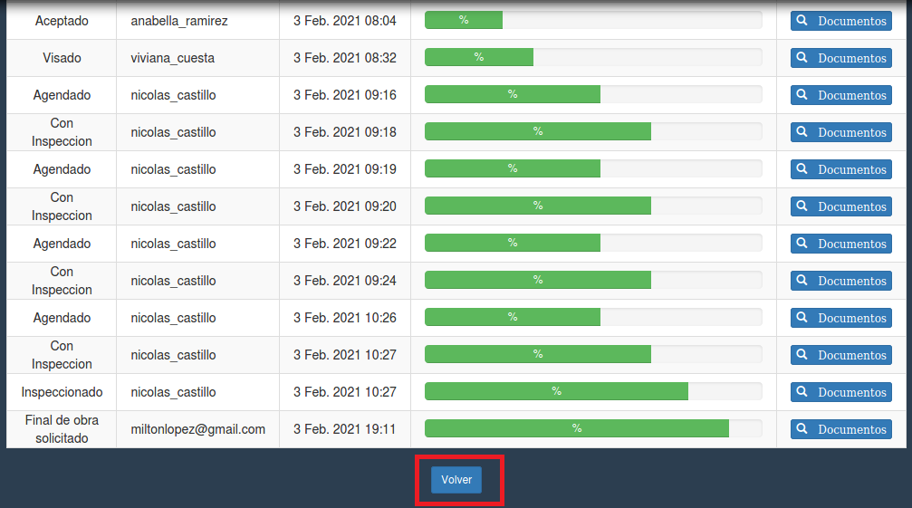

Historial del tramite
====================================

En la imagen de abajo se ve el historial del trámite, para regresar a la página anterior debe presionar el botón azul “Administrativo”, o el botón “Volver” enmarcado en rojo.
Se observa en detalle los datos del tramite y los estados, junto a una tabla con los siguientes datos:

- **Estado**
- **Usuario**
- **Fecha**
- **Progreso**
- **Ver (Documentos) aqui puede acceder a los documentos del tramite en detalle**

