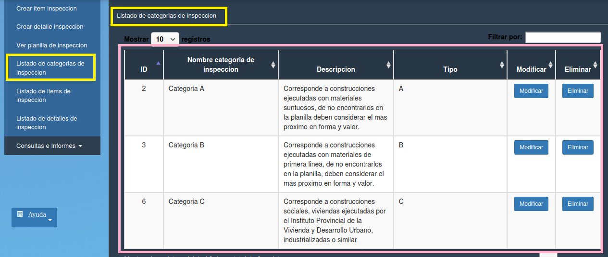

Listado de categorías de inspección
======================================

Se debe elegir la opción “Listado de categorías de inspección” en alguno de los dos paneles (izquierdo o central) resaltados en amarillo. Se despliega una tabla con los datos:

- **ID (id de la categoria)**
- **Nombre de categoria de inspeccion**
- **Descripcion**
- **Tipo**
- **Modificar** 
- **Eliminar**

- **Modificar** 

.. toctree::
   :maxdepth: 3

   modificarCategoriasInspeccion

- **Eliminar** 

.. toctree::
   :maxdepth: 3

   eliminarCategoriaInspeccion
