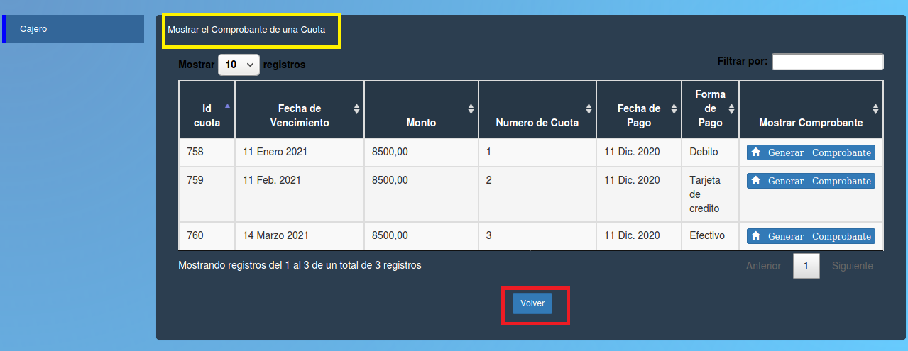

Mostrar el Comprobante de una cuota
======================================

En la tabla se puede observar los siguientes datos de las cuotas y sus comprobantes:

- **Id cuota**
- **Fecha vencimiento**
- **Monto**
- **Numero de cuota**
- **Fecha de pago** 
- **Mostrar comprobante (Generar comprobante)**

.. toctree::
   :maxdepth: 4
   
   comprobantePagoCajero
