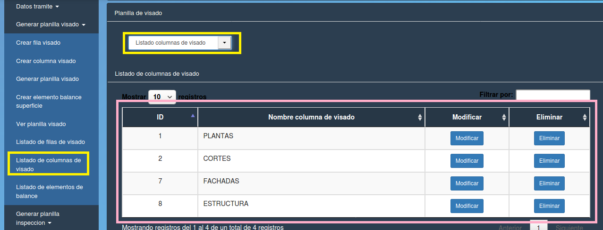

Listado elementos de visado
======================================

Se debe elegir la opción “Listado elementos de visado” en alguno de los dos paneles (izquierdo o central) resaltados en amarillo. Se despliega una tabla con los datos:

- **ID (id del elemento de visado)**
- **Nombre elemento de visado**
- **Descripcion**
- **Modificar** 
- **Eliminar**

- **Modificar**
 
.. toctree::
   :maxdepth: 3

   modificarElementoVisado

- **Eliminar** 

.. toctree::
   :maxdepth: 3

   eliminarElementoVisado
