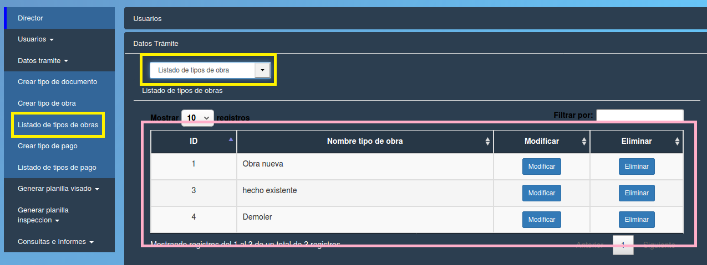

Listado de tipos de obra
======================================

Se debe elegir la opción “Listado de tipos de obra” en alguno de los dos paneles (izquierdo o central) resaltados en amarillo. Se despliega una tabla con los datos:

- **ID (id del tipo de obra)**
- **Nombre tipo de obra**
- **Modificar** 
- **Eliminar**

- **Modificar**

.. toctree::
   :maxdepth: 3
 
   modificarTipoObra

- **Eliminar**

.. toctree::
   :maxdepth: 3

   eliminarTipoObra
