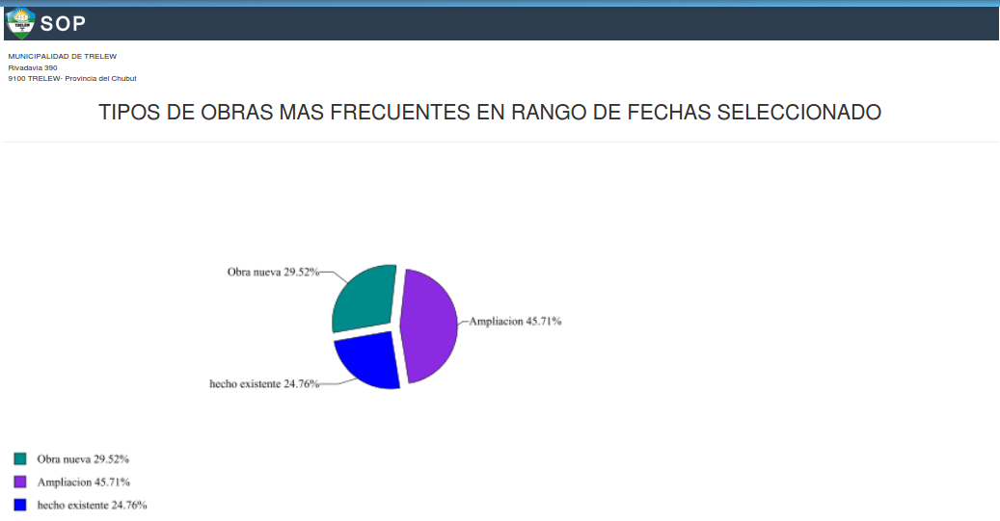
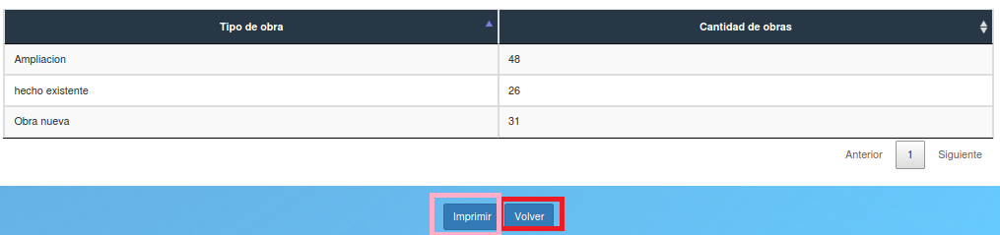

Grafico obras en periodo de fechas seleccionado
===============================================

Permite ver los tipos de obras en un rango de fechas seleccionado.  En caso de que el usuario quiera volver al menú principal, deberá presionar el botón “Volver” que está enmarcado en rojo. También el director puede exportar a formato PDF el reporte pulsando el botón azul “Imprimir” que está enmarcado en rosa.

