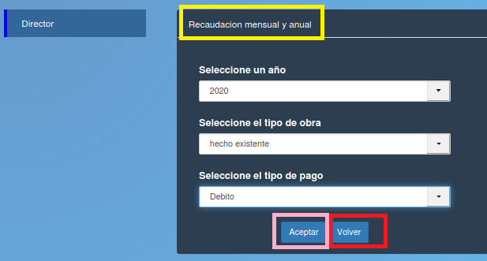

Ver recaudación mensual por tipo de obra y/o tipo de pago
==========================================================

Permite ver la recaudación mensual y anual del sistema seleccionando un año de interés en “Seleccionar un año”, un tipo de obra en “Selecciona el tipo de obra” y un tipo de pago en “Seleccionar el tipo de pago”. En caso de que el usuario quiera volver al menú principal, deberá presionar el botón “Volver” que está enmarcado en rojo y se encuentra en la parte central derecha de la pantalla o el botón “Director” que se encuentra en el panel lateral izquierdo. También el director puede exportar a formato PDF el reporte pulsando el botón azul “Imprimir” que está enmarcado en rosa y se encuentra en la parte central izquierda de la página.

.. toctree::
   :maxdepth: 3

   graficoRecaudacionMensualAnual
