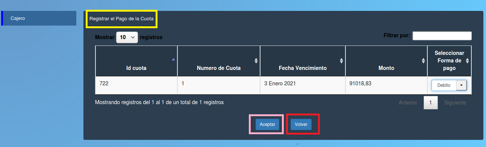

Registrar el pago de la cuota
====================================

En la imagen se ve la siguiente tabla con los datos:
-**Numero de cuota**
-**Fecha Vencimiento** 
-**Subtotal**
-**Tipo de pago**
-**Generar comprobante**

Aqui se ve el pago registrado con todos los datos y puede generar el comprobante de pago haciendo click sobre el botón “Generar comprobante”, después puede salir apretando el botón “Volver” remarcado en rojo. 

.. toctree::
   :maxdepth: 6
   
   registrarPagoCajero
