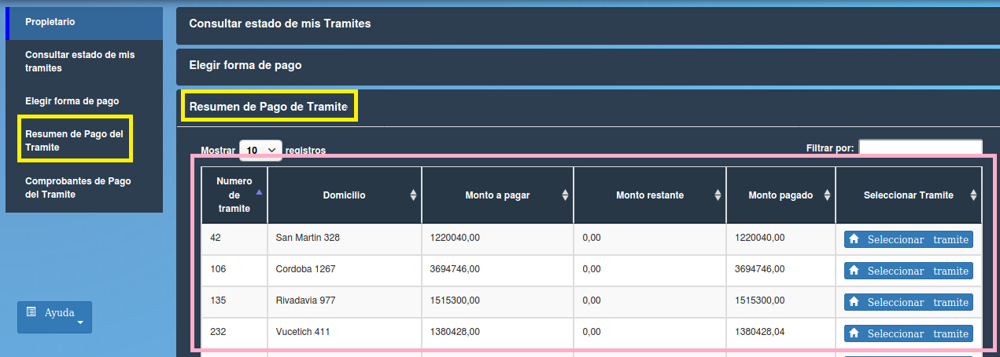

Resumen de pago de tramite
==============================================

Esta opción permite visualizar los resúmenes de pago de los trámites. Los datos contenidos en la tabla son:

- **Numero de tramite** 
- **Domicilio**
- **Monto a pagar**
- **Monto restante**
- **Monto pagado**
- **Seleccionar trámite (Seleccionar trámite)**

Al hacer click sobre el botón azul “Seleccionar trámite” el propietario puede acceder a los resúmenes de pago del trámite seleccionado para visualizarlos y si lo desea imprimirlos.

.. toctree::
   :maxdepth: 3
   
   resumenDePago
