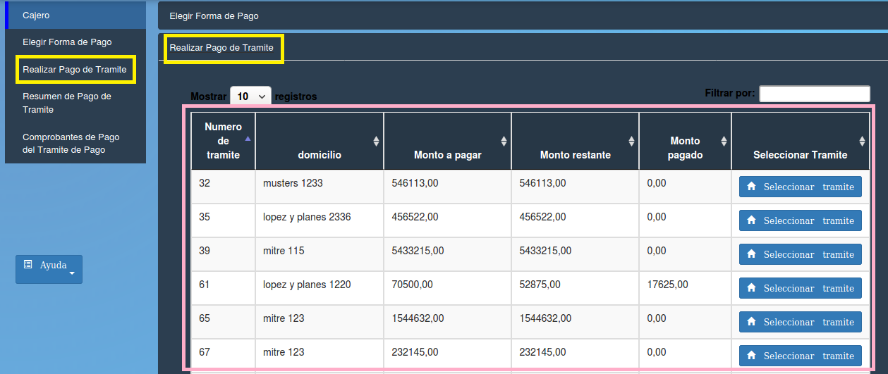

Realizar Pago de Tramite
====================================

Esta opción permite visualizar datos de los trámites. Los datos contenidos en la tabla son:

- **Numero de tramite**
- **Domicilio**
- **Monto a pagar** 
- **Monto restante** 
- **Monto pagado**
- **Seleccionar Tramite (Seleccionar tramite)**

.. toctree::
   :maxdepth: 3
   
   registrarCuotaTramite
