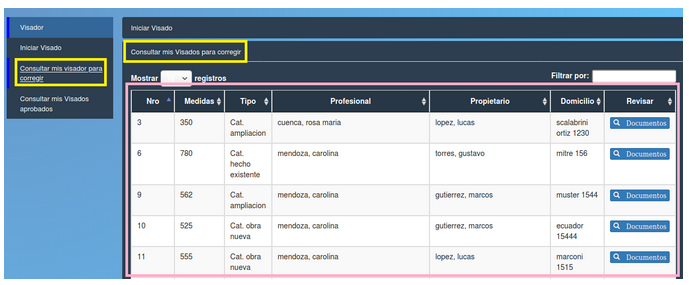

Consultar mis visados para corregir
====================================

El usuario debe seleccionar en alguno de los paneles la opción “Consultar mis visados para corregir” enmarcadas en amarillo. Se desplegará una tabla con los siguientes datos:

- **Nro (Número de trámite)**
- **Medidas**
- **Tipo**
- **Profesional**
- **Propietario**
- **Domicilio** 
- **Revisar (Documentos)**

.. toctree::
   :maxdepth: 3
   
   planillaVisadoParaCorregir

